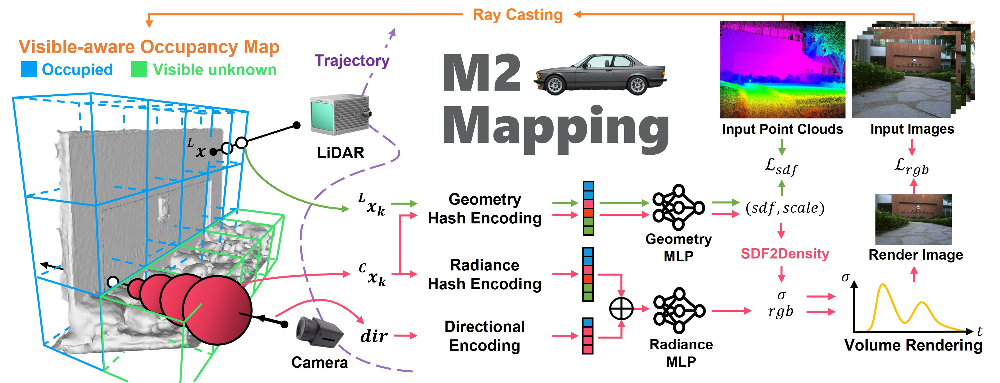

# M2Mapping

## Neural Surface Reconstruction and Rendering for LiDAR-Visual Systems

### 1. Introduction


A MultiModal Mapping (M2Mapping) Framework for LiDAR-Visual Systems.

[Project page](https://jianhengliu.github.io/Projects/M2Mapping/) | [Paper](https://arxiv.org/pdf/2409.05310) | [Video](https://www.youtube.com/watch?v=XFzzAGVbzek) | [M2Mapping Datasets](https://furtive-lamprey-00b.notion.site/M2Mapping-Datasets-e6318dcd710e4a9d8a4f4b3fbe176764) | [M2Mapping Results](https://furtive-lamprey-00b.notion.site/M2Mapping-Results-bf02b1b1ebbd443099e2f076019d1c51)

Our paper is accepted by ICRA 2025. If you use M2Mapping for your academic research, please cite the following paper:
```
@article{liu2024neural,
    title={Neural Surface Reconstruction and Rendering for LiDAR-Visual Systems}, 
    author={Jianheng Liu and Chunran Zheng and Yunfei Wan and Bowen Wang and Yixi Cai and Fu Zhang},
    journal={arXiv preprint arXiv:2108.10470},
    year={2024},
    }
```

### 2. Installation

- Tested on Ubuntu 20.04, cuda 11.8
> The software not relies on ROS, but under ROS noetic installed, the installation should be easier.
> And if real-time visualization is needed, ROS is required and refer to the [Visualization](#3-visualization) section.

```bash
  pip install open3d==0.18.0
  # Libtorch
  wget https://download.pytorch.org/libtorch/cu118/libtorch-cxx11-abi-shared-with-deps-2.4.1%2Bcu118.zip
  apt install zip
  unzip libtorch-cxx11-abi-shared-with-deps-*.zip
  rm *.zip
  echo "export Torch_DIR=$PWD/libtorch/share/cmake/Torch" >> ~/.bashrc # ~/.zshrc if you use zsh
  source ~/.bashrc # .zshrc if you use zsh

  mkdir -p m2mapping_ws/src
  cd m2mapping_ws/src
  apt install git libdw-dev
  git clone https://github.com/hku-mars/M2Mapping.git --recursive
  cd ..
  
  sudo apt install python3-catkin-tools # install catkin
  catkin_make # if lacking memory try restricting number of cores: catkin_make -j8
```

### 3. Data Preparation

- The processed FAST-LIVO2 Datasets and Replica Extrapolation Datasets are available at [M2Mapping Datasets](https://furtive-lamprey-00b.notion.site/M2Mapping-Datasets-e6318dcd710e4a9d8a4f4b3fbe176764)

#### 3.1. Replica

- Download the Replica dataset from [M2Mapping Datasets](https://furtive-lamprey-00b.notion.site/M2Mapping-Datasets-e6318dcd710e4a9d8a4f4b3fbe176764) and unzip it to `src/M2Mapping/data`:
  ```bash
  wget https://cvg-data.inf.ethz.ch/nice-slam/data/Replica.zip
  # Replica.zip, cull_replica_mesh.zip, and replica_extra_eval.zip are supposed under m2mapping_ws
  unzip -d src/M2Mapping/data Replica.zip
  unzip -d src/M2Mapping/data/Replica cull_replica_mesh.zip
  unzip -d src/M2Mapping/data replica_extra_eval.zip
  ```
- Arrange the data as follows:
  ```bash
  ├── Replica
  │   ├── room2
  │   │   ├── eval
  │   │   │   └── results
  │   │   │   │   └── *.jpg
  │   │   │   │   └── *.png
  │   │   │   └── traj.txt
  │   │   └── results
  │   │   │   └── *.jpg
  │   │   │   └── *.png
  │   │   └── traj.txt
  ```

#### 3.2. FAST-LIVO2 Datasets
- Download either Rosbag or Parsered Data in [M2Mapping Datasets](https://furtive-lamprey-00b.notion.site/M2Mapping-Datasets-e6318dcd710e4a9d8a4f4b3fbe176764).

- Arrange the data as follows:
  - For Rosbag:
    ```bash
    ├── data
    │   ├── FAST_LIVO2_Datasets
    │   ├── campus
    │   │   │   ├── fast_livo2_campus.bag
    ```
  - For Parsered Data:
    ```bash
    ├── data
    │   ├── FAST_LIVO2_Datasets
    │   │   ├── campus
    │   │   │   ├── images

    ```


#### 3.3. Custom FAST-LIVO2 Datasets

- Clone the [modified-FAST-LIVO2](https://github.com/jianhengLiu/FAST-LIVO2) repo; install and run FAST-LIVO2 as the official instruction. The overall pipeline as:
  ```bash
  roslaunch fast_livo mapping_avia.launch
  rosbag play YOUR_DOWNLOADED.bag
  rosbag record /aft_mapped_to_init /origin_img /cloud_registered_body /tf /tf_static /path -O "fast_livo2_YOUR_DOWNLOADED" -b 2048
  ```


### 4. Run

```bash
    source devel/setup.bash # or setup.zsh

    # Replica
    ./devel/lib/neural_mapping/neural_mapping_node train src/M2Mapping/config/replica/replica.yaml src/M2Mapping/data/Replica/room2
    # If ROS is installed, you can also run the following command:
    # rosrun neural_mapping neural_mapping_node train src/M2Mapping/config/replica/replica.yaml src/M2Mapping/data/Replica/room2

    # FAST-LIVO2 (ROS installed & ROS bag)
    ./devel/lib/neural_mapping/neural_mapping_node train src/M2Mapping/config/fast_livo/campus.yaml src/M2Mapping/data/FAST_LIVO2_RIM_Datasets/campus/fast_livo2_campus.bag
    # If ROS is installed, you can also run the following command:
    # rosrun neural_mapping neural_mapping_node train src/M2Mapping/config/fast_livo/campus.yaml src/M2Mapping/data/FAST_LIVO2_RIM_Datasets/campus/fast_livo2_campus.bag

    # FAST-LIVO2 (Parsered ROS bag format)
    ./devel/lib/neural_mapping/neural_mapping_node train src/M2Mapping/config/fast_livo/campus.yaml src/M2Mapping/data/FAST_LIVO2_RIM_Datasets/campus/color_poses.txt
    # If ROS is installed, you can also run the following command:
    # rosrun neural_mapping neural_mapping_node train src/M2Mapping/config/fast_livo/campus.yaml src/M2Mapping/data/FAST_LIVO2_RIM_Datasets/campus/color_poses.txt
```

After running, the training and evaluation results will be saved in the `src/M2Mapping/output` directory.

For afterward visualization/evaluation, you can use the following command:
```bash
    source devel/setup.bash # or setup.zsh
    ./devel/lib/neural_mapping/neural_mapping_node view src/M2Mapping/output/(your_output_folder)
    # If ROS is installed, you can also run the following command:
    # rosrun neural_mapping neural_mapping_node view src/M2Mapping/output/(your_output_folder)
```
Input `h` + `Enter` to see the help message.

### 5. Visualization

- Tested on Ubuntu 20.04, cuda 11.8, ROS Noetic
- We use RVIZ for visualization for now. Please install ROS Noetic following the [official guide](http://wiki.ros.org/noetic/Installation/Ubuntu) or refer to the [Docker](#6-docker) 'ROS Installation' section.
- Re-build the packege: 
  ```bash
  cd src
  git clone https://github.com/jianhengLiu/rviz_map_plugin.git
  git clone https://github.com/jianhengLiu/rviz_cinematographer.git
  sudo apt install ros-noetic-mesh-msgs ros-noetic-rviz-animated-view-controller ros-noetic-hdf5-map-io
  catkin_make -DENABLE_ROS=ON
  ```
- Run the following command to visualize the map in real-time:
  ```bash
  source devel/setup.bash # or setup.zsh
  roslaunch m2mapping rviz.launch
  ```
  Drag the view to activate and control the view with the mouse.
- For post-training visualization, you can use the following command:
  ```bash
  ./devel/lib/neural_mapping/neural_mapping_node view src/M2Mapping/output/(your_output_folder)
  # If ROS is installed, you can also run the following command:
  # rosrun neural_mapping neural_mapping_node view src/M2Mapping/output/(your_output_folder)

  roslaunch m2mapping rviz.launch
  ```

### 6. Docker

- We provide a [enroot](https://github.com/NVIDIA/enroot) docker image for testing.
  ```bash
  # https://github.com/NVIDIA/enroot
  enroot import docker://nvidia/cuda:11.8.0-cudnn8-devel-ubuntu20.04
  enroot create --name m2mapping ~/nvidia+cuda+11.8.0-cudnn8-devel-ubuntu20.04.sqsh
  # check if create right
  enroot list
  enroot start --root --rw m2mapping
  # ctrl + d to return

  cd ~
  # ROS Installation
  apt update
  apt install lsb-release
  sh -c 'echo "deb http://packages.ros.org/ros/ubuntu $(lsb_release -sc) main" > /etc/apt/sources.list.d/ros-latest.list'
  apt install curl # if you haven't already installed curl
  curl -s https://raw.githubusercontent.com/ros/rosdistro/master/ros.asc | apt-key add -
  apt update
  apt install ros-noetic-desktop-full
  # Dependencies
  apt install ros-noetic-mesh-msgs ros-noetic-rviz-animated-view-controller ros-noetic-hdf5-map-io
  echo "source /opt/ros/noetic/setup.bash" >> ~/.bashrc

  # Libtorch
  wget https://download.pytorch.org/libtorch/cu118/libtorch-cxx11-abi-shared-with-deps-2.4.1%2Bcu118.zip
  apt install zip
  unzip libtorch-cxx11-abi-shared-with-deps-*.zip
  rm *.zip
  echo "export Torch_DIR=$PWD/libtorch/share/cmake/Torch" >> ~/.bashrc
  source ~/.bashrc

  # upgrad cmake
  wget https://github.com/Kitware/CMake/releases/download/v3.23.0/cmake-3.23.0-linux-x86_64.sh
  bash ./cmake-3.23.0-linux-x86_64.sh --skip-licence --prefix=/usr 
  # opt1: y; opt2: n

  mkdir -p m2mapping_ws/src
  cd m2mapping_ws/src
  apt install git libdw-dev
  git clone https://github.com/hku-mars/M2Mapping.git --recursive
  cd ..
  catkin_make # if lacking memory try restricting number of cores: catkin_make -j8

  # Image export
  enroot export --output m2mapping.sqsh m2mapping
  ```

### 7. Acknowledgement

Thanks for the excellent open-source projects that we rely on:
[RIM](https://github.com/HITSZ-NRSL/RIM), [FAST-LIVO2](https://github.com/hku-mars/FAST-LIVO2), [ROG-Map](https://github.com/hku-mars/ROG-Map), [nerfacc](https://github.com/nerfstudio-project/nerfacc), [tiny-cuda-nn](https://github.com/NVlabs/tiny-cuda-nn), [kaolin-wisp](https://github.com/NVIDIAGameWorks/kaolin-wisp)
